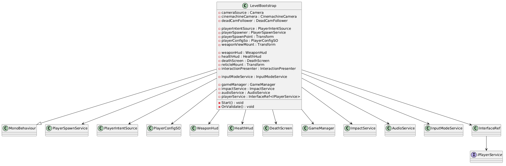
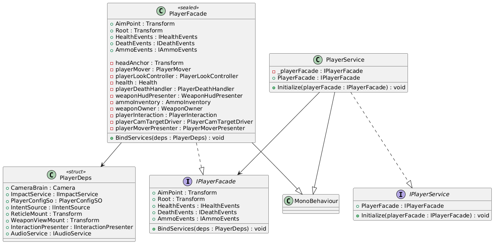
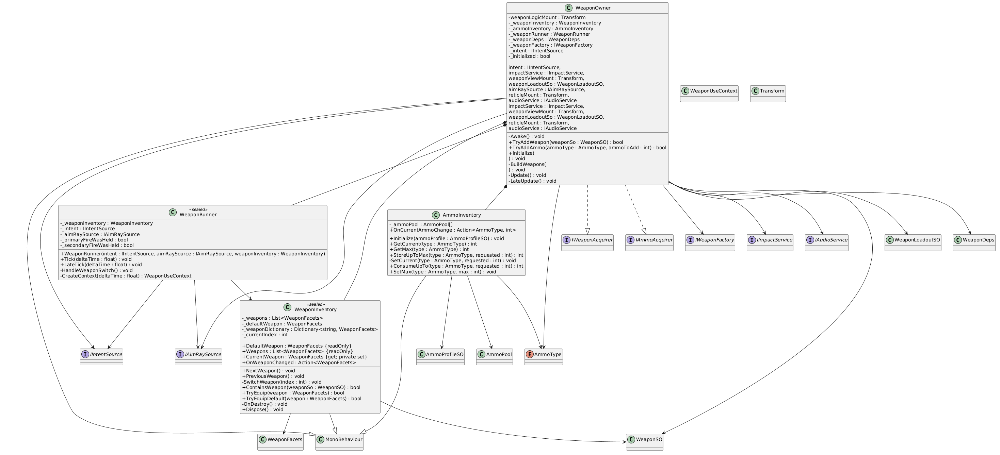
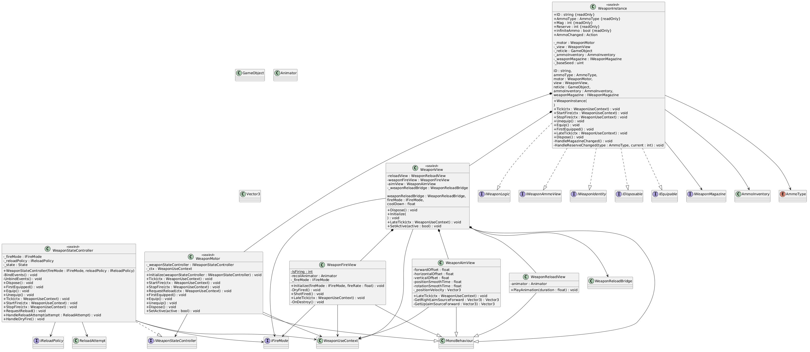
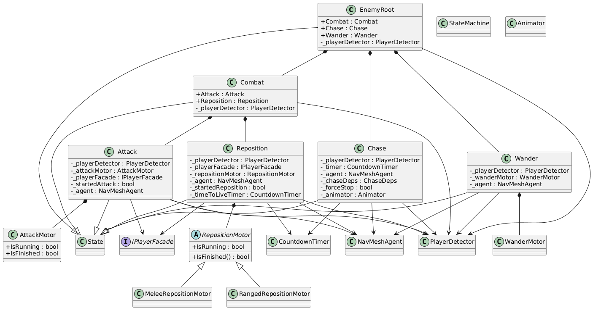

# Demo Video
https://github.com/user-attachments/assets/4928634b-61ea-4538-b223-d0534cb48460

# Tutorial
## Creating a new Scene
1. Start by creating a level bootstrap (the entry point for every service in the scene) and a PlayerSpawn service game object
2. Add the PlayerSpawnService script and Level Bootstrap script to the scene
3. Create an empty gameobject called camera and below and add a camera with a target camera source script and a dead camera adding a dead camera follower script
4. Create another empty gamobject and add a Player input, Input Mode Service, Player Intent Source, and Death UI Input script.
5. Add an UI Canvas and on the parent add a WeaponHud, Health Hud, and DeathScreen hud where below you create those respective displays of your choice making sure to drag in the text for the services to update
6. Drag in respective dependencies like the camera scripts, player config, UI scripts, and Input scripts
7. Start the scene and everything is ready to go!

## Adding a New Weapon
1. Create 3 prefabs 1 for the motor, 1 for the model/camera, and 1 for the retical
2. Underneath the motor prefab attach an empty gameobject called firepoint (this is where the weapon will fire from)
3. On the motor prefab attach 2 scripts, weapon motor, and CinemachineImpulse Source
4. On the retical attach a Weapon View, Weapon Reload Script, Weapon Aim View, Weapon Fire View, and Animator dragging the animator into the weapon fire view and weapon reload view
5. In the animator follow the setup of the demo adding 2 triggers (IsReloading, IsFiring)
6. Next create the Weapon Scriptable object (this is the core of the weapon) and drag the 3 prefabs as well as set the ammo type and any other additional parameters. Description for what they do is avalible when you hover over them
7. Next attach the fire mode scriptable object, emitter mode scriptable object, gun shot sfx scriptable object, and Source Visual impact to the Weapon Scriptable object
8. Create an AmmoProfile scriptable object and add a new entry (this will be the ammo that your player starts with) and making sure to set the ammo type to the ammo type on your weapon scriptable object
9. After create a WeaponLoadOut Scriptable object and add your Weapon scriptable object as a new entry or set the default weapon type to your weapon if you want it to persist across the inventory 
10. Next create a PlayerConfig scriptable object and attach the AmmoConfig, WeaponLoadout, and set a starting health
11. Once that is done drag the PlayerConfig to the LevelBootstrap and its all wired up and ready to go. Once the player spawn in they will have your weapon.

### Adding a weapon pickup
You have your weapon and now you want to pick it up in the scene. Easy, just follow the steps below.

1. Create a new weapon pickup scriptable object
2. Drag in your weapon and the audio cue of your choice for the pickup sound
3. Create a gameobject and add a Collider and a WorldPickup script.
4. Drag your scriptable object into the item and set the interact masking to whatever you want to pickup your weapon

## Adding a new interaction (Visual/Audio)
Things need to interact in your scene, well here is how to do it. Interactions are done by either calling the IInteractionService and passing that dependency down using the level bootstrap or by just calling the scene wide SceneService.InteractionService.
1. First create a new impact effect scriptable object setting it to whether its a stain or a splatter (stains persist for x seconds and splatter are one off effects)
2. Then create the impact prefab making sure to add the Stain Instance and/or Splatter Instance scripts to the root
3. Finally attach the prefabs to the PoolManager script 
4. Invoke the ImpactService either through the bootstrapped IImpactService or through the Scene Wide SceneService Impact Service

## Adding a new Enemy
The Enemy is based on an HSM approach where its behavior can be changed in the EnemyRoot

1. Create an enemy prefab adding an EnemyState Driver and player detector
2. Configure the fields as needed

## Adding a new Pickup
### Adding a new Health Pickup
1. Create an Health Pickup scriptable object
2. Create an AudioCue scriptable object for the ammo pickup sound
3. Drag the Audio cue into the AmmoPickup
4. Add a world pickup script to the scene and 

### Adding a new Ammo Pickup
1. Create an AmmoPickup scriptable object
2. Create an AudioCue scriptable object for the ammo pickup sound
3. Drag the Audio cue into the AmmoPickup
4. Add a world pickup script to the scene and drag in the AmmoPickup scriptable object

### Adding a new generic pickup
1. Create a script that inherits from ItemDefinition.
2. Create the fields and override TryApply (this is what will get called when the player interacts with your pickupable item. Also if you want visuals add the SceneServices.ImpactResolver to your script)
3. Add a CreateAssetMenu attribute to your class and once you exit the script you should see your item scriptable object 
4. Create the item scriptable object
5. Then create an empty gameobject object adding the world pickup to the script and a collider with maybe some graphics for visuals
6. Drag the item scriptable object to the world pickup and everything is ready to go  

# UML

## Game Flow
### Enemy State Machine
At first I implemented an FSM but as you can see I had multiple states intertwined and leading into many other states. Thats when I switched to an HSM putting the transitions that branched from multiple states into a parent state and then had child states handle there logic respectively.

### Interaction System
The interaction system on the player has 2 components, a visual, shoot a ray and tell me what i can interact with grabbing every IInteractable from the area and producing the best result, and a logical, through the interactable interface that i grabbed from my ray actually call interact. The visual side is done through runtime injection where the interaction presenter interface is injected into the player displaying a visual prompt and any highlighted meshes (if an IHighlightable interface is attached to the interactable). The logical side gets called directly by the player when the interact button is pressed.

### Effects System
Interactions produce effects from shooting a bullet, walking on different surfaces. These effects are done by pooling a prewarmed set of objects that are spawned in when the scene starts where these objects are just set active and its position/rotation is moved to the target surface when the interaction occurs. When a hit occurs the hit uses the hit service either through DI if its spawned in later or through a service provider if its already spawned in. The hit system uses the generic pool class to handle the actual renting out of the different instances based on what interaction was sent through the hit service. I also have a target surface override/additive feature so not only can the source produce hits but the entity that got hit can override or add to the interaction.

### Weapon and Player System
Weapon and players interact through 2 seperate systems the weapon runner which controls weapon ticking and weapon which is a swappable system that controls the internal state of the currently used weapon. The currently used weapon is found by looking at the WeaponInventory and its ammo by looking at the AmmoInventory. When a weapon is equipped it gets ticked in the weapon runner where it first goes through a weapon motor directly to a weapon state controller which is the central component that glues the fire and the reload together. The fire is handled in two states, a fire which has a fire mode and an emitter which determines whether whats firing is a raycast or a projectile.

## Schematics
### Level Boostrap

The Level Bootstrap is the entry point for the scene

### Player
#### Player Facade

The player facade is the bridge between external services and the player

#### Weapon Player Side

An internal player service

#### Weapon Weapon Side

This is an independent weapon service that ticks inside the player service allowing weapons to be swappable at runtime

### Enemy

